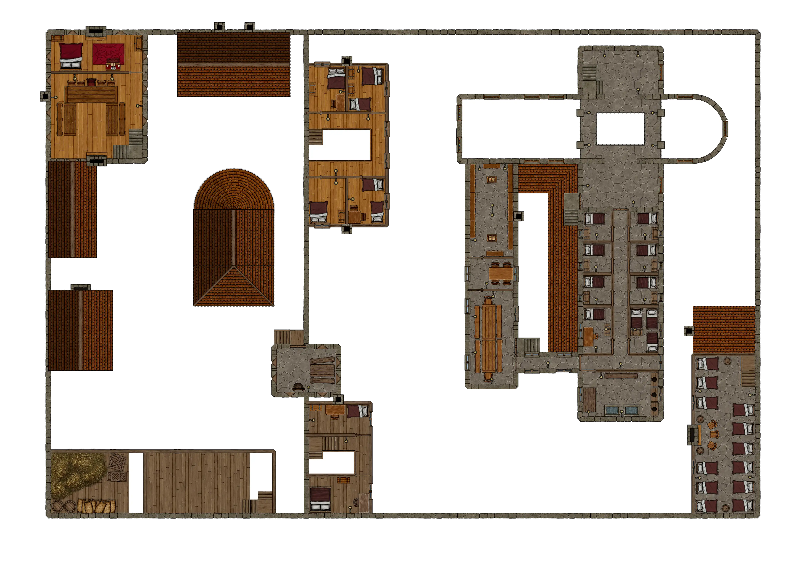

# HârnWorld Location Module: Lethyl Abbey

[)].download_count&url=https://api.github.com/repos/toastygm/hm-loc-lethyl/releases/latest&color=green)](https://github.com/toastygm/hm-loc-lethyl/releases/latest)

Lethyl Abbey is a "Location Module" for the [Foundry VTT](https://www.foundryvtt.com/)
system. This location module is designed to depict the Lethyl abbey in the far north of
the Kingdom of Kaldor, on the island of Hârn in the [HârnWorld](https://columbiagames.com/harnworld/)
fantasy setting; however, this manor could be adapted to exist anywhere in any fantasy
setting.

Although designed for use with the [HârnMaster](https://foundryvtt.com/packages/hm3)
system, this module is mostly system-agnostic.  Detailed descriptions of the actors
has been provided in journal entries to facilitate conversion to other game systems.

Lethyl is a prosperous, if slightly rustic, Laranian abbey dedicated to Saint Syrele.
It is bordered by the dark Kirsta Forest on the northern border of Fethael Hundred.
It is two and a half leagues from the town of Getha and the Silver Way. 

# Maps

The original maps from this work have been used as inspiration, and new maps have been
designed specifically to meet the requirements of the VTT environment.  The following
maps are part of this module.

## Lethyl Village

Map of Lethyl Village, including the central abbey.

## Dancing Trout Inn

Ground floor of the Inn:

Upper floor of the Inn:

## Lethyl Abbey

Ground floor of the abbey:

Upper floor of the abbey:

# Credits

This module is made possible by the hard work of HârnWorld fans,
and is provided at no cost. This work is an adaptation of the article
[Lethyl](https://www.lythia.com/harnworld/settlements/lethyl/) available
at the HârnWorld fan site [Lythia.com](https://www.lythia.com/).

**Writer:** Joe Adams

**Original Maps:** George Kelln

**Contributor:** Robert Barfield

**With Thanks To** Kerry Mould and Allan Prewett

**Adapted to Foundry VTT:** Tom Rodriguez

This module is "[Fanon](https://www.lythia.com/about/publishing-fan-written-material/)",
a derivative work of copyrighted material by Columbia Games Inc. and N. Robin Crossby.

Some assets used to create the maps in this module are from
[Forgotton Adventures](https://www.forgotten-adventures.net/).
